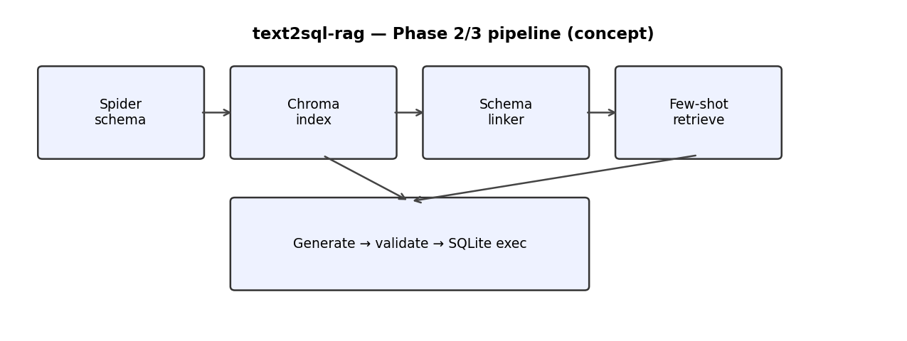

# text2sql-rag

Phase 1 scaffold for **schema-first retrieval** over the [Spider](https://yale-lily.github.io/spider) text-to-SQL dataset: load public schema files, embed schema text with **BAAI/bge-small-en-v1.5**, store vectors in **Chroma**, link natural-language questions to relevant tables/columns, and validate candidate **SQLite** SQL with **SQLGlot**.

This repository uses only **public Spider materials and standard open techniques** (dataset hosting, embedding models, vector stores). No proprietary or employer-specific artifacts.

Spider data is distributed under [CC BY-SA 4.0](https://creativecommons.org/licenses/by-sa/4.0/legalcode).

## Quick start

```bash
python -m venv .venv
source .venv/bin/activate   # Windows: .venv\Scripts\activate
pip install -U pip
pip install -e ".[dev]"
cp .env.example .env
bash scripts/download_spider.sh
pytest -q
bash scripts/smoke_test.sh
```

Set `SPIDER_DATA_DIR` (see `.env.example`) if you unpack Spider somewhere other than `./data/spider`.

### Phase 2 demo CLI

Run indexing + one example answer (echo or Groq) from the activated env:

```bash
python -m text2sql_rag.cli_demo --build-indexes
# After pip install -e ., equivalently:
text2sql-rag-demo --build-indexes
```

- **Echo** (`generators.provider: echo` in `configs/default.yaml`) returns SQL parsed from the top retrieved few-shot document (expects a `Question:` / `SQL:` chunk from the few-shot indexer).
- **Groq** (`generators.provider: groq`): set **`GROQ_API_KEY`** in your environment before running (`--provider groq` overrides the YAML provider for `cli_demo`).

### Phase 3 — benchmark + Gradio

Aggregate metrics over a shuffled slice of `train.json`:

```bash
python -m text2sql_rag.benchmark_run --limit 40 --seed 1
# outputs results/benchmark_summary.{json,md}
```

Optional UI (install `pip install -e ".[demo]"`):

```bash
python demo/gradio_phase3.py
```

Docs: [`docs/benchmark.md`](docs/benchmark.md), HF outline [`docs/huggingface_space.md`](docs/huggingface_space.md), static overview [`docs/DEMO.md`](docs/DEMO.md).



### Spider data layout expected on disk

- `database/<db_id>/*.sqlite` (Spider’s per-database SQLite files, typically `{db_id}.sqlite`)
- **`train.json`** (and optional `tables.json`) at the Spider root referenced by `spider.data_dir` / `SPIDER_DATA_DIR`

### Windows note

Use Git Bash or WSL to run the `.sh` scripts, or run the equivalent commands manually (see script contents).

## Layout

- `src/text2sql_rag/` — loaders, schema models, Chroma indexer, linker, SQL validator, generator/eval stubs
- `configs/default.yaml` — defaults for paths, model name, Chroma collection
- `scripts/download_spider.sh` — fetch Spider zip (Google Drive mirror via `gdown`)
- `scripts/smoke_test.sh` — quick sanity checks after install
- `tests/` — indexer, linker, validator tests (use minimal fixtures; full Spider optional)

## Phase roadmap

- **Phase 1–2:** shipped in `src/text2sql_rag/` (indexer, linker, validator, few-shot, generators, CLI).
- **Phase 3:** `benchmark_run` + Gradio shell + docs above.
- **Phase 4 (optional):** leaderboard-scale sweeps / hosted demo polish.

## License

Project code is under the [MIT License](LICENSE). Spider data retains its CC BY-SA 4.0 license from the dataset distributors.
